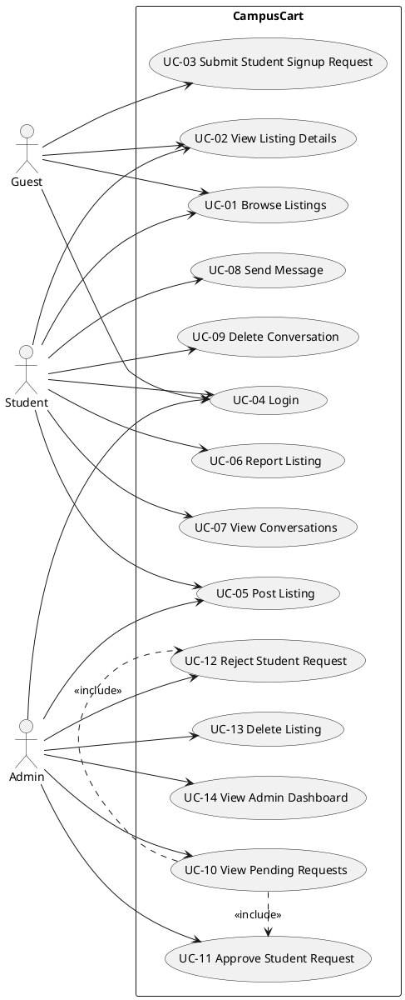
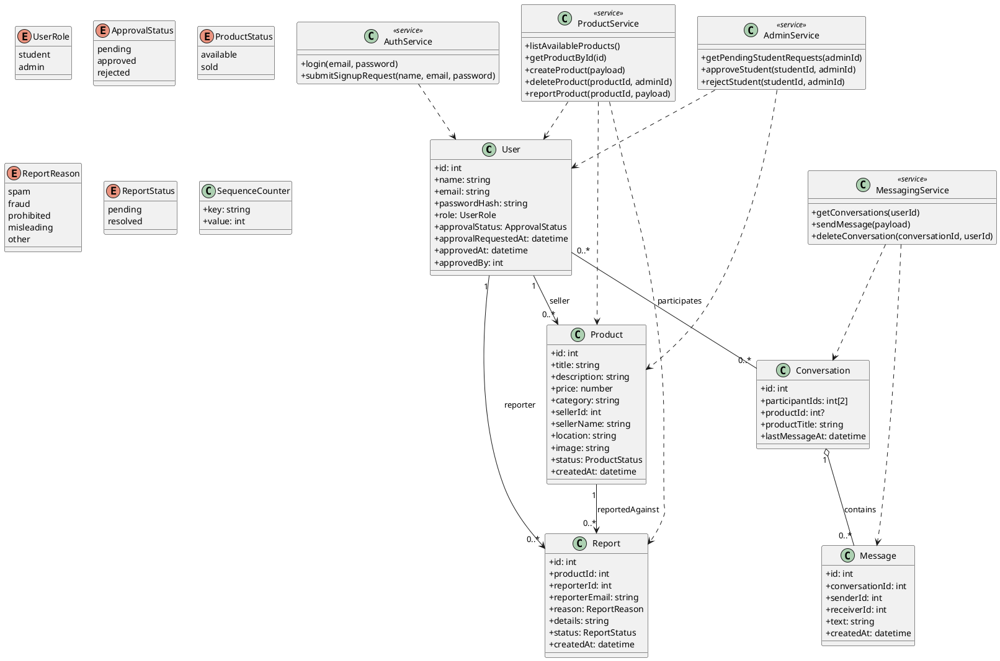
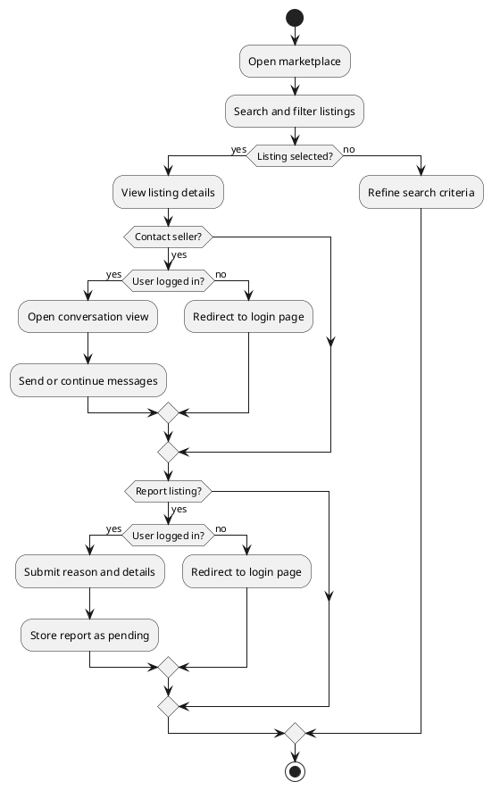
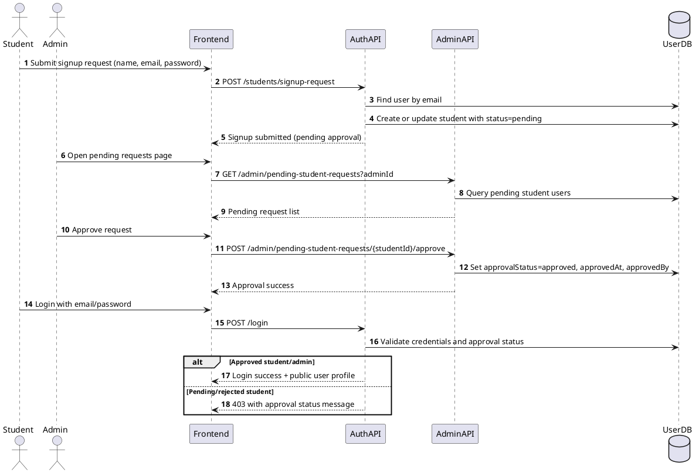
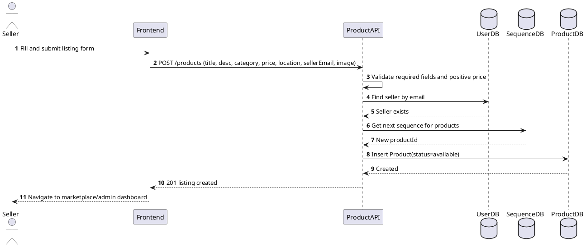
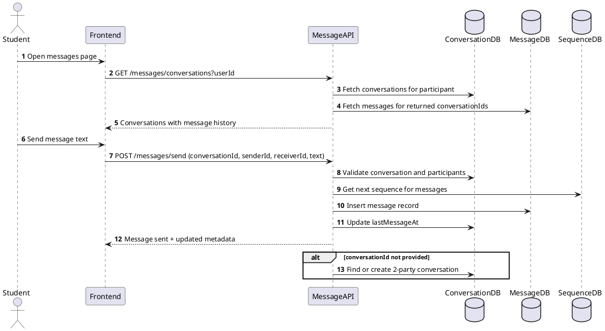
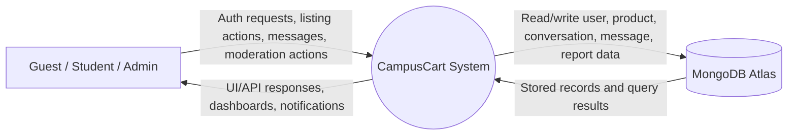
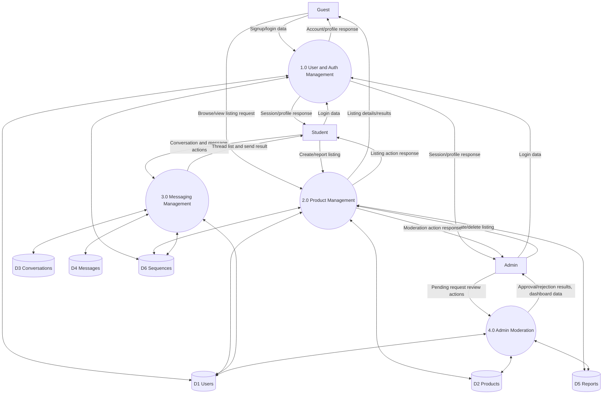

# CampusCart System Design Documentation

Version: 1.0  
Date: 2026-04-24  
System: CampusCart (Student Marketplace)

## 1. SRS (Software Requirement Specification)

### 1.1 Introduction

#### Purpose
This document defines the functional and non-functional requirements of CampusCart and provides a consistent system design blueprint (Use Cases, UML, and DFD). It is intended for developers, reviewers, and maintainers implementing or extending the platform.

#### Scope
CampusCart is a web-based marketplace where students can list items, browse listings, chat with other users, and report suspicious listings. Admins manage marketplace quality by approving student signups and moderating listings.

#### Definitions
| Term | Meaning |
|---|---|
| Guest | Unauthenticated user browsing public marketplace pages |
| Student | Approved user who can post listings and use messaging |
| Admin | Privileged user who approves students and moderates marketplace data |
| Listing | Product posted for sale in the marketplace |
| Conversation | Chat thread between two users, optionally tied to a listing |
| Report | Complaint raised by a user against a listing |
| Approval Status | Student account state: `pending`, `approved`, or `rejected` |

### 1.2 Overall Description

#### Product Perspective
CampusCart is a 3-tier web application:
1. React + Vite frontend (SPA)
2. Node.js + Express REST API backend
3. MongoDB Atlas persistence layer

The frontend invokes backend APIs for authentication, products, messaging, and admin actions. The backend enforces validation, authorization checks by role, and persistence using domain collections.

#### User Classes
| User Class | Description | Key Capabilities |
|---|---|---|
| Guest | Not logged in | Browse listings, view details, open login/signup |
| Student (Pending) | Signup requested but not approved | Cannot log in until approved |
| Student (Approved) | Authenticated standard user | Post listing, browse, report, message, manage profile session |
| Admin | Authenticated privileged user | Dashboard, approve/reject students, delete listings, view users/metrics |

#### Assumptions and Constraints
1. Email is unique per user account.
2. Student login is blocked until admin approval.
3. Marketplace transactions and payments are outside this system boundary.
4. One conversation is between two participants; it can optionally reference one product.
5. Product image payload may be base64 and is bounded by API body-size limits.
6. Role-based access is enforced at API and route-level UI guards.
7. System runs on modern browsers and campus network-grade internet conditions.

### 1.3 Functional Requirements

| ID | Requirement |
|---|---|
| FR-01 | System shall allow guests to browse available listings. |
| FR-02 | System shall allow users to view listing details by listing ID. |
| FR-03 | System shall allow students to submit signup requests with `name`, `email`, and `password`. |
| FR-04 | System shall reject login for students whose approval status is not `approved`. |
| FR-05 | System shall authenticate users using email/password and return user role/profile on success. |
| FR-06 | System shall allow approved students and admins to create listings with required fields (title, description, category, price, location, sellerEmail). |
| FR-07 | System shall validate that listing price is a positive numeric value. |
| FR-08 | System shall allow only admins to delete listings. |
| FR-09 | System shall allow authenticated users to report listings with reason and optional details. |
| FR-10 | System shall prevent a user from reporting their own listing. |
| FR-11 | System shall prevent duplicate pending reports for same reporter and listing pair. |
| FR-12 | System shall allow users to fetch their conversation list and messages. |
| FR-13 | System shall allow users to send messages in conversations where they are participants. |
| FR-14 | System shall allow conversation deletion only by a participant of that conversation. |
| FR-15 | System shall allow admins to view pending student requests. |
| FR-16 | System shall allow admins to approve student signup requests. |
| FR-17 | System shall allow admins to reject student signup requests. |
| FR-18 | System shall expose health endpoint for API/database connectivity checks. |

### 1.4 Non-Functional Requirements

| ID | Category | Requirement |
|---|---|---|
| NFR-01 | Performance | 95% of read API requests should complete within 2 seconds under normal campus load. |
| NFR-02 | Availability | API health endpoint shall indicate degraded state when DB connection is unavailable. |
| NFR-03 | Security | Passwords shall be stored as bcrypt hashes; plaintext storage is prohibited. |
| NFR-04 | Security | Role-restricted operations (approve/reject/delete) must deny unauthorized users with 403 responses. |
| NFR-05 | Reliability | Input validation errors shall return clear 4xx responses without crashing service. |
| NFR-06 | Scalability | Data model and APIs shall support growth in users, listings, and messages without schema redesign. |
| NFR-07 | Maintainability | Backend shall be modularized by route/service/model concerns for easier updates. |
| NFR-08 | Usability | Frontend shall provide clear success/failure feedback for auth, listing, report, and messaging actions. |
| NFR-09 | Portability | System shall run on Node.js 18+ and modern Chromium/Firefox/Safari browsers. |
| NFR-10 | Data Integrity | Numeric IDs generated via sequence counters shall remain unique per entity type. |

## 2. Use Case Model

### 2.1 Actors
1. Guest
2. Student
3. Admin
4. MongoDB Atlas (external data service actor)

### 2.2 Detailed Use Cases

#### UC-01 Browse Listings
Primary Actor: Guest, Student, Admin  
Description: User views available products on the home marketplace screen.  
Preconditions: API is reachable.  
Postconditions: Product list is displayed or empty-state shown.

#### UC-02 View Listing Details
Primary Actor: Guest, Student, Admin  
Description: User opens a specific listing to see details, seller info, and actions.  
Preconditions: Listing ID exists.  
Postconditions: Listing detail screen rendered or not-found message shown.

#### UC-03 Submit Student Signup Request
Primary Actor: Guest  
Description: Guest submits student onboarding request for admin approval.  
Preconditions: Unique student email and valid input fields.  
Postconditions: User record stored with `approvalStatus = pending`.

#### UC-04 Login
Primary Actor: Student, Admin  
Description: User authenticates using email and password.  
Preconditions: Account exists; for students, approval status must be `approved`.  
Postconditions: Authenticated session context established in frontend.

#### UC-05 Post Listing
Primary Actor: Student, Admin  
Description: Authenticated user creates a new listing.  
Preconditions: User logged in and form contains mandatory fields with valid price.  
Postconditions: New `Product` record created with `status = available`.

#### UC-06 Report Listing
Primary Actor: Student, Admin  
Description: Authenticated user reports a listing as suspicious/inappropriate.  
Preconditions: Reporter is not listing owner; reason is valid enum.  
Postconditions: New pending `Report` record stored.

#### UC-07 View Conversations
Primary Actor: Student  
Description: Student retrieves conversation threads and message history.  
Preconditions: Student logged in and has valid user ID.  
Postconditions: Conversations displayed, sorted by latest activity.

#### UC-08 Send Message
Primary Actor: Student  
Description: Student sends message to another participant within a conversation.  
Preconditions: Student is participant; message text is non-empty.  
Postconditions: `Message` stored and conversation timestamp updated.

#### UC-09 Delete Conversation
Primary Actor: Student  
Description: Student removes a conversation and its messages from their view/system.  
Preconditions: Student is participant of target conversation.  
Postconditions: Conversation and linked messages deleted.

#### UC-10 View Pending Student Requests
Primary Actor: Admin  
Description: Admin loads queued student signup requests awaiting decision.  
Preconditions: Admin authenticated.  
Postconditions: Pending request list shown.

#### UC-11 Approve Student Request
Primary Actor: Admin  
Description: Admin approves a pending student account.  
Preconditions: Student request exists; admin authenticated.  
Postconditions: Student `approvalStatus = approved`, timestamps updated.

#### UC-12 Reject Student Request
Primary Actor: Admin  
Description: Admin rejects a pending student account request.  
Preconditions: Student request exists; admin authenticated.  
Postconditions: Student `approvalStatus = rejected`.

#### UC-13 Delete Listing (Moderation)
Primary Actor: Admin  
Description: Admin removes an active listing from marketplace.  
Preconditions: Admin authenticated and listing exists.  
Postconditions: Listing removed from product collection.

#### UC-14 View Admin Dashboard
Primary Actor: Admin  
Description: Admin views aggregate marketplace stats, users, and listings.  
Preconditions: Admin authenticated.  
Postconditions: Dashboard panels populated with latest fetched data.

### 2.3 Use Case Diagram



Diagram note: This diagram maps the primary platform capabilities by actor role. Student and Admin share some base marketplace actions while admin-specific moderation actions are isolated. Approval actions are modeled as included behaviors from pending-request review.

## 3. UML Diagrams

### 3.1 Class Diagram



Diagram note: The class model combines core domain entities with service abstractions used by API routes. Relationships align with moderation, listing, and messaging behavior. Enum types encode role/status constraints used in validation and authorization.

### 3.2 Activity Diagram (Marketplace Interaction)



Diagram note: This activity captures core student-side marketplace behavior from browse to interaction. Decision branches show authentication gates around messaging/reporting and preserve guest read-only access.

### 3.3 Sequence Diagrams (Key Workflows)

#### Workflow A: Student Signup, Admin Approval, and Login



Diagram note: This sequence models the full onboarding gate with a human-in-the-loop approval step. The final login branch enforces the student approval policy consistently with business rules.

#### Workflow B: Create Listing



Diagram note: This sequence highlights validation, seller identity resolution, ID generation, and persistence. It also reflects role-shared listing creation for approved students and admins.

#### Workflow C: Messaging in Conversation



Diagram note: This sequence supports both existing-thread messaging and API-level creation fallback when conversation ID is absent. Participant validation protects conversation access boundaries.

## 4. Collaboration (Communication) Diagrams

### 4.1 Workflow A Collaboration Diagram

```plantuml
@startuml
left to right direction
object Student
object Admin
object Frontend
object AuthAPI
object AdminAPI
database UserDB

Student -> Frontend : 1: submitSignup()
Frontend -> AuthAPI : 1.1: POST signup-request
AuthAPI -> UserDB : 1.1.1: create/update pending student
AuthAPI -> Frontend : 1.2: signup response

Admin -> Frontend : 2: viewPendingRequests()
Frontend -> AdminAPI : 2.1: GET pending requests
AdminAPI -> UserDB : 2.1.1: query pending users
AdminAPI -> Frontend : 2.2: pending list

Admin -> Frontend : 3: approve(studentId)
Frontend -> AdminAPI : 3.1: POST approve
AdminAPI -> UserDB : 3.1.1: set status approved

Student -> Frontend : 4: login()
Frontend -> AuthAPI : 4.1: POST login
AuthAPI -> UserDB : 4.1.1: validate credentials/status
AuthAPI -> Frontend : 4.2: auth result
@enduml
```

Diagram note: Numbered messages emphasize object collaboration rather than strict time lanes. It matches the same interaction set as Sequence Workflow A.

### 4.2 Workflow B Collaboration Diagram

```plantuml
@startuml
left to right direction
object Student
object Frontend
object ProductAPI
database UserDB
database SequenceDB
database ProductDB

Student -> Frontend : 1: submitListingForm()
Frontend -> ProductAPI : 1.1: POST /products
ProductAPI -> ProductAPI : 1.1.1: validate payload
ProductAPI -> UserDB : 1.1.2: resolve seller by email
ProductAPI -> SequenceDB : 1.1.3: next product sequence
ProductAPI -> ProductDB : 1.1.4: insert product
ProductAPI -> Frontend : 1.2: listing created
Frontend -> Student : 1.3: success UI/navigation
@enduml
```

Diagram note: This communication view focuses on responsibility distribution across API logic and persistence components for listing creation. It mirrors Sequence Workflow B.

### 4.3 Workflow C Collaboration Diagram

```plantuml
@startuml
left to right direction
object Student
object Frontend
object MessageAPI
database ConversationDB
database MessageDB
database SequenceDB

Student -> Frontend : 1: openMessages()
Frontend -> MessageAPI : 1.1: GET conversations
MessageAPI -> ConversationDB : 1.1.1: fetch by userId
MessageAPI -> MessageDB : 1.1.2: fetch message history
MessageAPI -> Frontend : 1.2: conversation payload

Student -> Frontend : 2: sendMessage(text)
Frontend -> MessageAPI : 2.1: POST /messages/send
MessageAPI -> ConversationDB : 2.1.1: validate participants
MessageAPI -> SequenceDB : 2.1.2: next message sequence
MessageAPI -> MessageDB : 2.1.3: insert message
MessageAPI -> ConversationDB : 2.1.4: update lastMessageAt
MessageAPI -> Frontend : 2.2: send success
@enduml
```

Diagram note: This diagram preserves numbered interactions for read and write message flows. It corresponds directly to Sequence Workflow C.

## 5. DFD (Data Flow Diagrams)

### 5.1 Level 0 DFD (Context Diagram)



Diagram note: Level 0 treats CampusCart as a single process interacting with external actors and the database service. It defines system boundary and primary data exchanges.

### 5.2 Level 1 DFD



Diagram note: Level 1 decomposes CampusCart into four major processes aligned with API modules. Data stores map directly to persistent entities and shared sequence generation.

## 6. Consistency Mapping (SRS to Diagrams)

| SRS Area | Covered In |
|---|---|
| Authentication and approval gate | UC-03, UC-04, UC-10, UC-11, UC-12; Sequence A; Collaboration A; DFD P1/P4 |
| Product lifecycle and moderation | UC-01, UC-02, UC-05, UC-06, UC-13; Sequence B; Collaboration B; DFD P2 |
| Messaging workflows | UC-07, UC-08, UC-09; Sequence C; Collaboration C; DFD P3 |
| Data model constraints | Class Diagram enums/associations; DFD stores D1-D6 |
| Operational monitoring | FR-18; DFD process boundary and system interactions |

## 7. Summary
CampusCart is a role-based student marketplace with a moderated onboarding model, listing lifecycle controls, and peer-to-peer messaging. The SRS, use cases, UML, and DFD artifacts are synchronized around the same actors, entities, workflows, and business rules.
